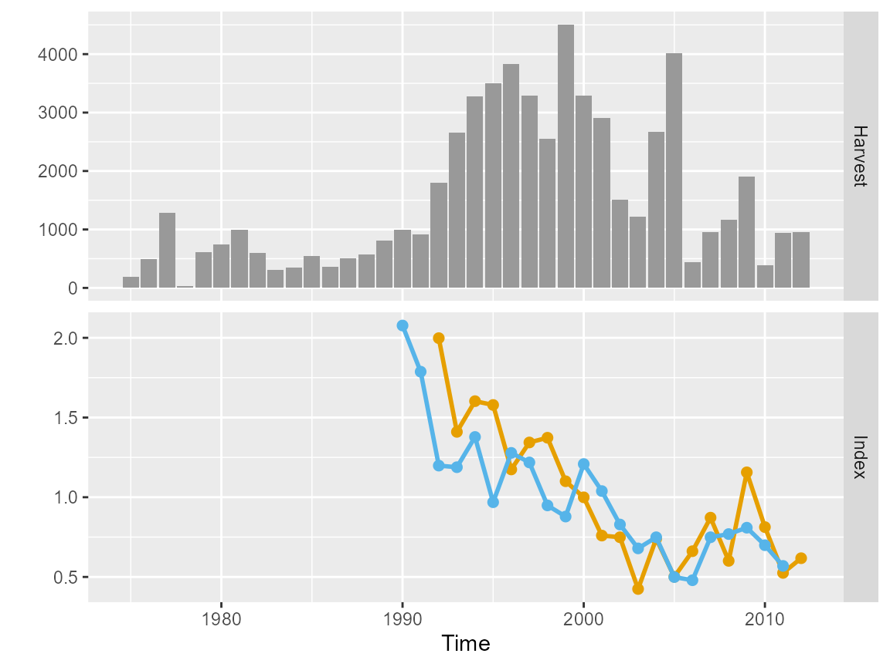
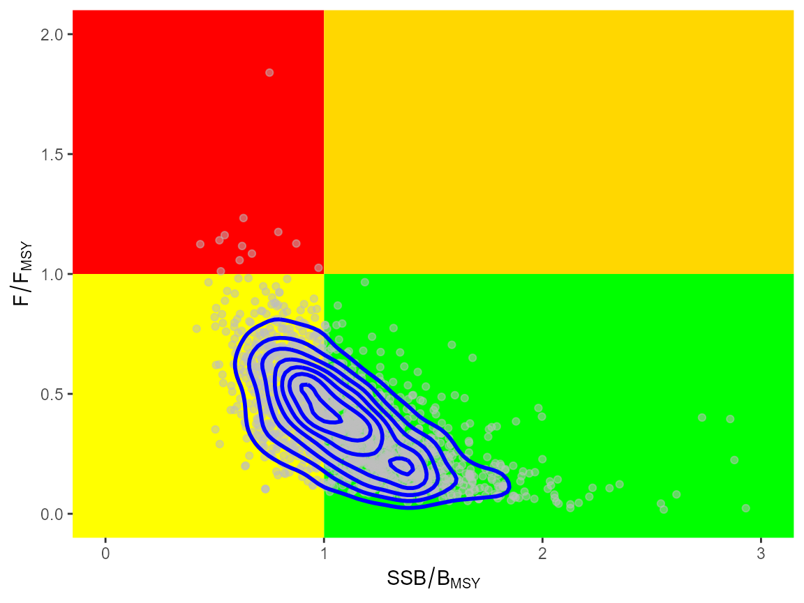
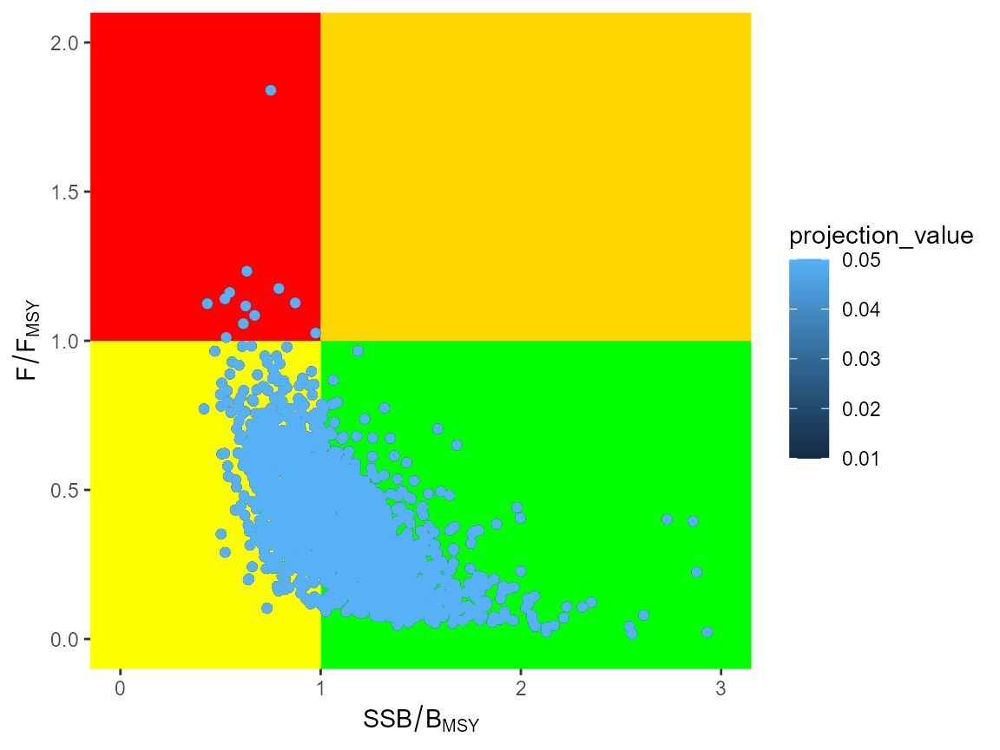

# Example application of \`bdm\`

Example applications of the `bdm` R-package are given here, based on
data from fisheries in New Zealand.

``` r
library(bdm)
library(lhm)
library(ggplot2)
library(dplyr)
library(kobe)
```

## Chatham Rise Hake

The model is fitted to data from the chatham rise hake fishery in New
Zealand, which consists of catches, a commerical abundance index and a
survey index. The data are used to initialise an empirical data object
(`bdmData`) that checks the data are in an appropriate format. See
[`?bdmData`](https://github.com/biomass-dynamic-models/bdm/reference/bdmData-class.md)
for details.

``` r
data(haknz)
dat <- bdmData(harvest = haknz$landings, index = cbind(haknz$survey, haknz$cpue),
    time = haknz$year, renormalise = TRUE)
plot(dat)
```



Chatham rise hake data

### Development of a prior for $`r`$

Life history data are available, allowing us to populate an object of
the `lhm` class, which is obtained from the `lhm` (life-history module)
package, and is used to store and manipulate life-history data.
Monte-carlo samples are generated, and application of the
[`lhm::rCalc`](https://github.com/biomass-dynamic-models/lhm/reference/rCalc.html)
function to this class of object calcuates values of $`r`$ for each
iteration, producing an object of the `prior` class. The `prior` class
contains a numeric vector with an additional slot for holding parameters
of the associated distribution. Currenly only the log-normal
distribution is supported, with parameters stored in
`object@lognormal_par`.

``` r
# initialise lhm data object for calculation of r with uncertainty
rdat <- lhm(ainf = 100, iter = 200)

# then life-history vectors can be assigned to each iteration with or
# without uncertainty
nmort(rdat) <- list(mu = 0.18)
maturity(rdat) <- c(0, 0.01, 0.02, 0.06, 0.14, 0.28, 0.5, 0.72, 0.86, 0.94,
    0.98, 0.99, 1)
size(rdat) <- list(mu = list(Linf = 106.5, k = 0.229, t0 = 0.01))
mass(rdat) <- list(mu = list(a = 1.88e-09, b = 3.305))
sr(rdat) <- list(type = "BH", mu = 0.9, cv = 0.1)

# calculate r prior and fit log-normal distribution
r <- rCalc(rdat)
plot(r)
```


Prior for $`r`$ generated from life-history data for chatham rise hake.

### Estimation of depletion

The default model is initialised using the
[`bdm()`](https://github.com/biomass-dynamic-models/bdm/reference/bdm-class.md)
command, with no arguments. Arguments can be supplied in the form or
alternative model code. The default initialisation loads a generalised
surplus production model, which will be used for this example. Following
initialisation of the model, the prior information on $`r`$, contained
in the `prior` object, can be loaded using the `updatePrior` function,
which takes as input the `bdm` and `prior` objects. This function
updates the model code directly, following which it must be compiled.

``` r
mdl <- bdm()
mdl <- updatePrior(mdl, r)
mdl <- compiler(mdl)
```

Note that it is also possible to update the priors in the model code by
using a list argument to `updatePrior` (see
[`?updatePrior`](https://github.com/biomass-dynamic-models/bdm/reference/updatePrior.md)
for details).

The default generalised surplus production model allows the depletion at
maximum sustainable yield (MSY) to be fixed by the user. The depletion
at MSY ($`\phi`$) forms part of the model inputs encoded in the
`bdmData` object and can be accessed or assigned using the
[`shape()`](https://github.com/biomass-dynamic-models/bdm/reference/shape.md)
function. For chatham rise hake we assume that MSY occurs at 40% of the
carrying capacity (i.e. $`\phi=0.4`$).

``` r
shape(dat) <- 0.4
```

The model can then be run using the
[`sampler()`](https://github.com/biomass-dynamic-models/bdm/reference/sampler.md)
function, which makes use of the R-package `rstan` to implement an MCMC
sampling routine. Arguments match those used by the
[`sampling()`](https://mc-stan.org/rstan/reference/stanmodel-method-sampling.html)
function from `rstan`.

``` r
mdl <- sampler(mdl, dat, run = "NZ hake", chains = 2, iter = 2000, init = "fixed")
```

Trace, posterior histogram and cumulative density plots can be produced
using the
[`traceplot()`](https://mc-stan.org/rstan/reference/stanfit-method-traceplot.html),
[`histplot()`](https://github.com/biomass-dynamic-models/bdm/reference/histplot.md)
and
[`cumsumplot()`](https://github.com/biomass-dynamic-models/bdm/reference/cumsumplot.md)
functions, respectively.

``` r
traceplot(mdl, inc_warmup = FALSE) + theme_bw()
```


Traceplots for chatham rise hake fit.

``` r
histplot(mdl, par = c("r", "logK", "q"))
```


Posterior histograms for chatham rise hake fit.

``` r
cumsumplot(mdl, par = c("r", "logK"))
```


Cumulative posterior denisty plot for chatham rise hake fit.

### Model outputs

We can plot model outputs using the
[`dynplot()`](https://github.com/biomass-dynamic-models/bdm/reference/dynplot.md)
function, which by default plots the `depletion()` trajectory over time.
Currently it can also be used to visualise `biomass`,
`surplus_production`, and the `harvest_rate`.

``` r
dynplot(mdl)
```


Estimated depletion for chatham rise hake.

Plotting functions
[`traceplot()`](https://mc-stan.org/rstan/reference/stanfit-method-traceplot.html),
[`histplot()`](https://github.com/biomass-dynamic-models/bdm/reference/histplot.md)
and
[`dynplot()`](https://github.com/biomass-dynamic-models/bdm/reference/dynplot.md)
return graphical objects from the `ggplot2` package and can be modified
before they are printed. For example, to add a title to the plot of
surplus production and change the y-axis one could type:

``` r
gg <- dynplot(mdl, pars = c("harvest_rate", "depletion"))
gg <- gg + ggtitle("Model predicted dynamics") + theme_bw()
print(gg)
```

We can use the function `refpoints` to extract the reference point
information from the fitted model object as a `list` that contains
`msy`, `depletion_at_msy` (which is equal to $`\phi`$), `biomass_at_msy`
and `harvest_rate_at_msy`. These reference points are functions of
$`r`$, $`K`$ and $`\phi`$, and therefore (with the exception of $`\phi`$
itself) have a posterior distribution. We can extract the median values
and write them in a table using
[`pander::pandoc.table`](https://rdrr.io/pkg/pander/man/pandoc.table.return.html):

``` r
knitr::kable(data.frame(lapply(refpoints(mdl), median)), digits = 2)
```

|    r |  logK |     msy | depletion_at_msy | biomass_at_msy | harvest_rate_at_msy |
|-----:|------:|--------:|-----------------:|---------------:|--------------------:|
| 0.26 | 10.78 | 2421.12 |              0.4 |       19161.22 |                0.13 |

Similarly, the function
[`status()`](https://github.com/biomass-dynamic-models/bdm/reference/status.md)
can be used to access posterior distributions of `current_biomass`,
`current_depletion` and `current_harvest_rate`, which correspond to the
final assessment year, i.e. `dat$time[dat$T]`. We could easily plot
these as histograms, using for example:

``` r
sta <- status(mdl)
dfr <- bind_rows(lapply(names(sta), function(x) data.frame(name = x, value = as.numeric(sta[[x]]))))
gg <- ggplot(dfr) + geom_histogram(aes(x = value)) + facet_wrap(~name, scales = "free_x",
    ncol = 2)
print(gg)
```


Current status estimates for chatham rise hake.

Note that the depletion is given relative to $`K`$. This is a more
robust estimate of status than status relative to $`MSY`$.
Neverthelessw, if desired, we could extract the status relative to
$`MSY`$ based reference points by using a combination of the
[`refpoints()`](https://github.com/biomass-dynamic-models/bdm/reference/status.md)
and
[`status()`](https://github.com/biomass-dynamic-models/bdm/reference/status.md)
functions.

### The `kobe` package

It is possible to produce kobe plots by using the `as.kobe` function,
which creates a `data.frame` in the appropriate format for the `kobe`
package.

``` r
assmt <- as.kobe(mdl, year = max(mdl@data$time))
```

The Kobe risk assessment framework has been developed by scientists at
the International Commission for the Conservation of Atlantic Tunas
(ICCAT), as a means of presenting status advice. The stock is assessed
relative to $`B_{MSY}`$ and $`H_{MSY}`$. If $`B < B_{MSY}`$ then it is
classified as overfished. If $`H > H_{MSY}`$ then overfishing is taking
place. Status can be visualised as a kobe phase plot, which is produced
using the
[`kobe::kobePhase`](https://rdrr.io/pkg/kobe/man/kobePhase-method.html)
function.

``` r
kobePhase(assmt) + geom_point(aes(stock, harvest), alpha = 0.5, col = "grey") +
    geom_density2d(aes(stock, harvest), col = "blue", linewidth = 1)
```



Kobe plot of current stock status.

The `as.kobe` function can also be used to produce a summary of stock
status over time; specifically the probability that the stock is in the
green, red and yellow quadrants of the phase plane.

``` r
assmt <- as.kobe(mdl, what = "summary")
knitr::kable(assmt, digits = 2)
```

The current status estimates of the stock can be obtained in a similar
manner to the reference points above.

``` r
knitr::kable(data.frame(lapply(status(mdl), median)), digits = 2)
```

| current_biomass | current_depletion | current_harvest_rate | current_biomass_over_bmsy | current_depletion_over_dmsy | current_harvest_rate_over_hmsy |
|---:|---:|---:|---:|---:|---:|
| 19707.33 | 0.43 | 0.05 | 1.07 | 1.07 | 0.38 |

### Projections

Based on these we can perform projections exploring alternative constant
harvest rate options. The `project` function returns a `list` (see
[`?project`](https://github.com/biomass-dynamic-models/bdm/reference/project.md))
which can be manipulated to summarise the results. For example:

``` r
# project forward under a variety of constant harvest rate scenarios
mdl.project <- project(mdl, harvest = c(0.01, 0.025, 0.05), time = 100)

# generate depletion results table
dep.project <- apply(mdl.project$depletion, 2:3, median)
knitr::kable(apply(mdl.project$depletion, 2:3, median)[nrow(dep.project), ,
    drop = FALSE], digits = 2)
```

|      |    1 |    2 |    3 |
|:-----|-----:|-----:|-----:|
| 2112 | 0.93 | 0.84 | 0.71 |

``` r

# display kobe plot
proj <- as.kobe(mdl, mdl.project, year = max(mdl@data$time))
kobePhase(proj) + geom_point(aes(stock, harvest, col = projection_value))
```


