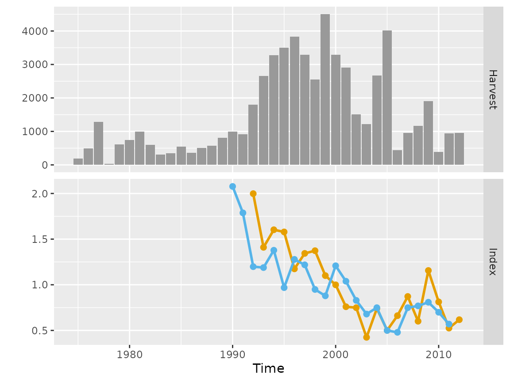

# A non-default model application

Example applications of non-default (i.e. user-specified) models in the
`bdm` R-package are given here, based on data from fisheries in New
Zealand.

``` r

library(bdm)
```

## Chatham Rise Hake

The model is fitted to data from the chatham rise hake fishery in New
Zealand, which consists of catches, a commerical abundance index and a
survey index. The data are used to initialise an empirical data object
(`bdmData`) that, by default, renormalises the indices to a geometric
mean of one. See
[`?bdmData`](https://github.com/biomass-dynamic-models/bdm/reference/bdmData-class.md)
for details.

``` r

data(haknz)
dat <- bdmData(harvest = haknz$landings,index = cbind(haknz$survey, haknz$cpue), time = haknz$year, renormalise = TRUE)
plot(dat)
```



Chatham rise hake data

The revised model could be coded with the following changes relative to
the default model:

``` r

  new_model <- "
    ...
    parameters {
      real<lower=3,upper=30> logK;
      real<lower=0,upper=2> r;
      array[T] real<lower=0> x;
      real<lower=0> sigmap2; 
    }
    ...
    model {
      
      // prior densities for
      // estimated parameters
      // ********************
      logK ~ uniform(3.0,30.0);
      r ~ lognormal(-1.0,0.20);
      sigmap2 ~ inv_gamma(0.001,0.001);
      
      ...
    }
    ...
  "
```

This new formulation includes a revision of our assumptions regarding
the process error, allowing the variance to be estimated. We can update
the model code using a `list` argument supplied to the `updatePrior`
function. It is then necessary to compile the model:

``` r

mdl <- bdm(model_code = new_model)
mdl <- updatePrior(mdl, prior = list(par = 'r', meanlog = -0.91, sdlog = 0.40))
mdl <- compiler(mdl)
```

If a new model is loaded into the `bdm` object, and if the estimated
parameters are not the same as the default, then the initialisation
function within
[`sampler()`](https://github.com/biomass-dynamic-models/bdm/reference/sampler.md)
will not work. This function provides sensible values for the MCMC
algorithm. If the new model were to be run without an initialisation
function then initial parameter values will be generated randomly by
`rstan`.

To construct a new inititialisation function we can use some of the
auxiliary functions that are implemented for the default model:

``` r

init.r    <- getr(mdl)[['E[r]']]
init.logK <- getlogK(dat, r = init.r, interval = c(1, 100))
init.x    <- getx(dat, r = init.r, logK = init.logK)
```

These values can be used to create the initialisation function that must
return a list of initial values:

``` r

init.func <- function() list(r = init.r, logK = init.logK, x = init.x, sigmap2 = 0.0025)
mdl <- sampler(mdl, dat, init = init.func)
```

``` r

histplot(mdl,par = c('r','logK','sigmap2'))
```


Posterior histogram plots for chatham rise hake fit using the new
non-default model

We note that the model is unable to resolve a value for `logK`, and
estimates an excessively high value for `sigmap2`. It would therefore be
considered to have failed as an assessment. This can also be seen from
the catchability traces, which behave poorly:

``` r

traceplot(mdl,par = 'q')
```


Catchability trace plots plots for chatham rise hake fit using the new
non-default model
